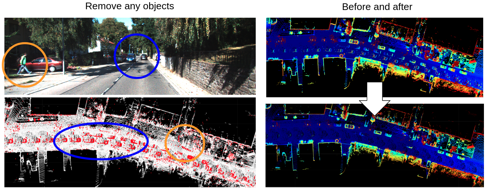
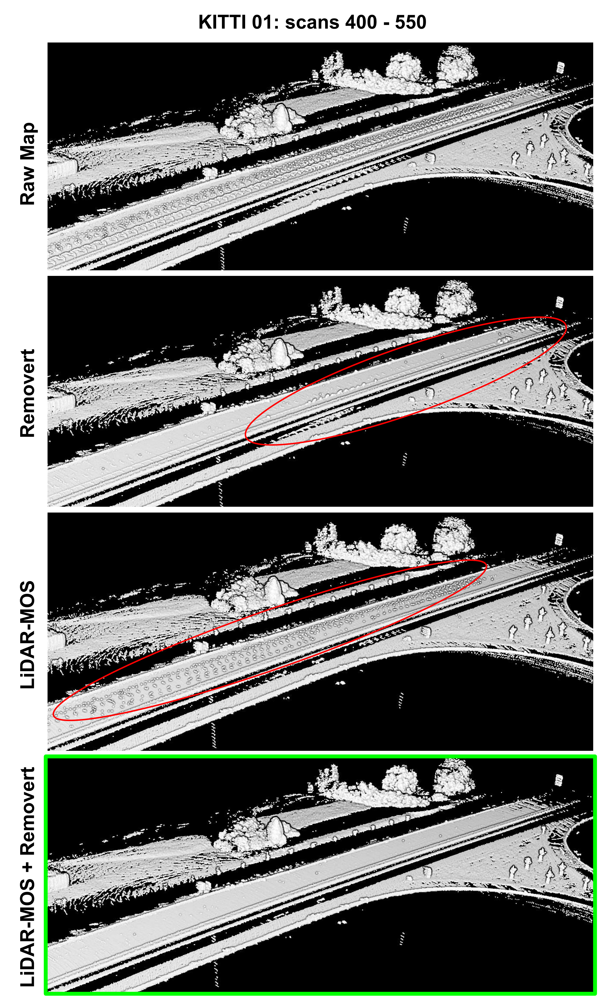

# *Removert*

## What is removert?
- Static map construction in the wild. 
- A dynamic points removing tool by constructing a static map
- The name is from the abbreviation of our title "***Remov***e-then-re***vert***" (IROS 2020): [paper](https://irap.kaist.ac.kr/publications/gskim-2020-iros.pdf), [video](https://youtu.be/M9PEGi5fAq8)

## What can we do using removert? 
- We can easily construct and save a static map. 
- We can easily parse dynamic points 

## Example
- [Video 1: KITTI 09](https://youtu.be/V6OcdNVQRwg) with [SuMa poses](http://jbehley.github.io/projects/surfel_mapping/)
- [Video 2: MulRan dataset with poses from SC-LIO-SAM](https://youtu.be/UiYYrPMcIRU)
<p align="center"></p>

## Preparations
- Step 1: Get a set of LiDAR scans and corresponding poses by running any open source LiDAR odometry or SLAM algorithm (e.g., [pose-and-scan saver of SC-LIO-SAM](https://github.com/gisbi-kim/SC-LIO-SAM#applications) or [pose-and-scan saver of SC-A-LOAM](https://github.com/gisbi-kim/SC-A-LOAM#utilities))
- Step 2: Make a pair of a scan's point cloud and a corresponding pose using associated timestamps. We note that you need to save a scan as a binary format as KITTI and the pose file as a single text file where SE(3) poses are written line-by-line (12 numbers for a single line), which is also the equivalent format as KITTI odometry's ground truth pose txt file.

## Requirements 
- Based on C++17
- ROS (and Eigen, PCL, OpenMP): the all examples in this readme are tested under Ubuntu 18.04 and ROS Melodic. 
- FYI: We uses ROS's parameter parser for the convenience, despite no topic flows within our system (our repository currently runs at offline on the pre-prepared scans saved on a HDD or a SSD). But the speed is fast (over 10Hz for a single removing) and plan to extend to real-time slam integration in future.

## How to use 
- First, compile the source 
```
$ mkdir -p ~/catkin/removert_ws/src
$ cd ~/catkin/removert_ws/src
$ git clone https://github.com/irapkaist/removert.git
$ cd ..
$ catkin_make
$ source devel/setup.bash
```
- Before to start the launch file, you need to replace data paths in the config/params.yaml file. More details about it, you can refer the above tutorial video ([KITTI 09](https://youtu.be/V6OcdNVQRwg))

- Then, you can start the *Removert*
```
$ roslaunch removert run_kitti.launch # if you use KITTI dataset 
 or
$ roslaunch removert run_scliosam.launch # see this tutorial: https://youtu.be/UiYYrPMcIRU
```

- (Optional) we supports Matlab tools to visulaize comparasions of original/cleaned maps (see tools/matlab).


## Further Improvements 
- We propose combining recent deep learning-based dynamic removal (e.g., [LiDAR-MOS](https://github.com/PRBonn/LiDAR-MOS)) and our method for better map cleaning 
    - Deep learning-based removal could run online and good for proactive removal of bunch of points. 
    - Removert currently runs offline but good at finer cleaning for the remained 3D points after LiDAR-MOS ran.     
- A [tutorial video](https://youtu.be/zWuoqtDofsE) and an example result for the KITTI 01 sequence: 
<p align="center"></p>

## Contact 
```
paulgkim@kaist.ac.kr
```

## Cite *Removert*
```
@INPROCEEDINGS { gskim-2020-iros,
    AUTHOR = { Giseop Kim and Ayoung Kim },
    TITLE = { Remove, then Revert: Static Point cloud Map Construction using Multiresolution Range Images },
    BOOKTITLE = { Proceedings of the IEEE/RSJ International Conference on Intelligent Robots and Systems (IROS) },
    YEAR = { 2020 },
    MONTH = { Oct. },
    ADDRESS = { Las Vegas },
    NOTE = { Accepted. To appear. },
}
```

## License
 <a rel="license" href="http://creativecommons.org/licenses/by-nc-sa/4.0/"></a><br />This work is supported by Naver Labs Corporation and by the National Research Foundation of Korea (NRF). This work is also licensed under a <a rel="license" href="http://creativecommons.org/licenses/by-nc-sa/4.0/">Creative Commons Attribution-NonCommercial-ShareAlike 4.0 International License</a>.

## TODO (in order)
#### Near future 
- Full sequence cleaned-scan saver by automatically iterating batches (because using 50-100 scans for a single batch is recommended for computation speed)
- Adding revert steps (I think certainly removing dynamic points is generally more worthy for many applications, so reverting step is omitted currently)
- Automatically parse dynamic segments from the dynamic points in a scan (e.g., using DBSCAN on dynamic points in a scan)
- [x] Exmaples from MulRan dataset (for showing removert's availability for various LiDAR configurations) — see this [tutorial](https://youtu.be/UiYYrPMcIRU) 
- [x] (scan, pose) pair saver using SC-LeGO-LOAM or [SC-LIO-SAM](https://github.com/gisbi-kim/SC-LIO-SAM#applications), which includes a loop closing that can make a globally consistent map. — see this [tutorial](https://youtu.be/UiYYrPMcIRU)
- Examples from the arbitrary datasets using the above input data pair saver.
- Providing a SemanticKITTI (as a truth) evaluation tool (i.e., calculating the number of points of TP, FP, TN, and FN) 
- (Not certain now) Changing all floats to double

#### Future 
- Real-time LiDAR SLAM integration for better odometry robust to dynamic objects in urban sites (e.g., with LIO-SAM in the Riverside sequences of MulRan dataset)
- Multi-session (i.e., inter-session) change detection example
- Defining and measuring the quality of a static map
- Using the above measure, deciding when removing can be stopped with which resolution (generally 1-3 removings are empirically enough but for highly crowded environments such as urban roads) 
